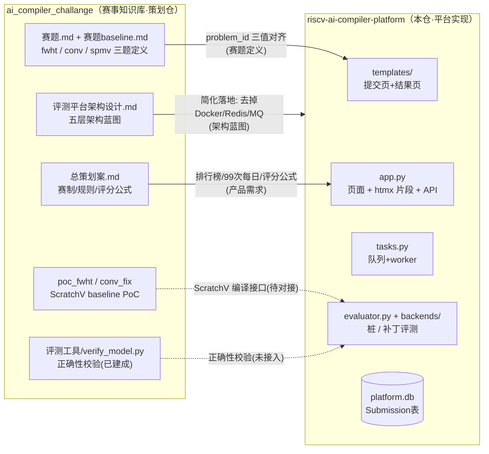
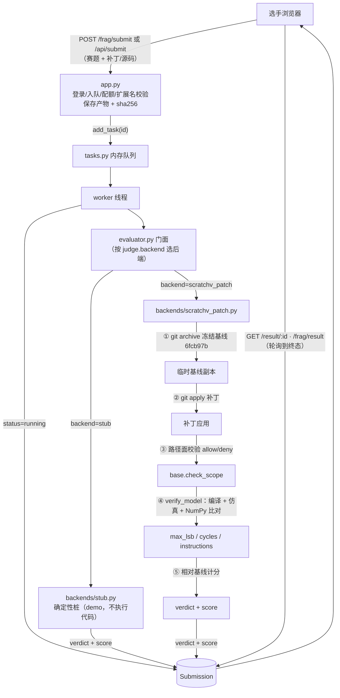

# riscv-ai-compiler-platform

「RISC-V AI 编译器挑战赛」的**线上评测平台**（Flask + SQLite 的轻量 OJ 原型）。

姊妹仓 [`ai_compiler_challange`](../ai_compiler_challange) 是赛事的**策划与赛题仓库**（总策划案、赛题、baseline 验证）；本仓是其中"评测系统"一节的**最小可运行落地**。

## 快速开始

```bash
pip install -r requirements.txt
python app.py        # http://0.0.0.0:5000
```

## 功能

- **身份与组队**：邮箱注册 / 登录；邀请码建队 / 入队 / 退队（每队 1~3 人）。
- **提交评测**：登录且已入队后提交赛题产物——
  - `demo` 赛道：上传 `.py`，走**确定性桩**评测（不执行选手代码，用于公开演示）。
  - `contest` 赛道：上传改造 ScratchV 编译器的**补丁**（`.patch` / `.diff`）。
- **后台 worker 异步评测**：取冻结基线 → `git apply` 补丁 → 路径面校验 → 固定 ONNX 赛题编译仿真 → 与 NumPy 参考比对（Q16.16 ≤1 LSB）→ verdict + 计分。
- **排行榜**（按题目筛选，当日 05:00（UTC+8）结算，取 top 50）+ **结果详情页**（轮询到终态停止）。
- **配额**：每队每日 99 次 + 软限频。

## 仓库结构

| 文件 | 职责 |
|------|------|
| `app.py` | Flask 入口：页面（`/`、`/problems`、`/standings`、`/submit`、`/result/<id>`）、htmx 片段（`/frag/*`）与 JSON API |
| `platform.yaml` | 全部可切换配置（赛道 / 配额 / 上传 / 评测后端 / ScratchV 基线 / 路径面 / 计分）；支持 `PLATFORM_*` 环境变量覆盖 |
| `config.py` | 加载 `platform.yaml` + Flask 配置 |
| `models.py` | `Submission` / `User` / `Team` / `TeamMember`；verdict 文案与徽章映射 |
| `auth.py` | `auth` 蓝图：注册 / 登录 / 组队 / `/api/me` / CSRF / 登录限频 |
| `tasks.py` | 内存队列 + 后台 worker 线程；启动时清理僵尸提交 |
| `evaluator.py` | 评测门面：按配置选后端 |
| `backends/` | `stub.py`（离线确定性桩）、`scratchv_patch.py`（真实补丁评测）、`base.py`（路径面校验） |
| `problems.py` / `standings.py` | 赛题元数据（赛道切换）/ 榜单聚合 |
| `templates/` · `static/` | 服务端渲染页面与设计系统（Bootstrap 5 CDN，零构建链） |

## 与 ai_compiler_challange 的关系

```
ai_compiler_challange（赛事知识库）          riscv-ai-compiler-platform（本仓）
├─ 总策划案.md  ——赛事规则/赛制──────→  排行榜、提交次数等产品需求来源
├─ 评测平台架构设计.md ——蓝图──────→  本仓是其简化 PoC（无 Docker/Redis/MQ）
├─ 赛题.md ——fwht/conv/spmv 三题────→  contest 赛道 problem_id（当前仅 conv/fwht，缺 spmv）
├─ 评测工具/verify_model.py ——正确性─→  backends/scratchv_patch.py 已接入
└─ ScratchV baseline PoC ─────────→  已对接：补丁 + 冻结基线 6fcb97b
```

## 现状与待办

平台**可运行**，P0~P3 已完成（详见 `docs/03-实现记录.md`）。真实赛道上线前仍需：

- **沙箱隔离**：应用/运行选手补丁 = 执行选手代码，当前为本地受信运行；上线前必须 Docker 化（无网络、只读基线、资源限额）。
- **真实后端平台级 E2E**：`backends/scratchv_patch.py` 代码完整，但尚未经平台完整跑通「提交补丁 → 结果页」（独立 `verify_model.py` 已实测 PASS）。
- **赛题覆盖不全**：`platform.yaml` 的 `contest_problems` 目前只有 `conv` / `fwht`，**缺 `spmv`**。
- P4 管理端 / P5 Stage 2 现场赛延后 v2。

## 关系流图

### 两仓关系



### 平台内部评测流水线（P3 后端）


