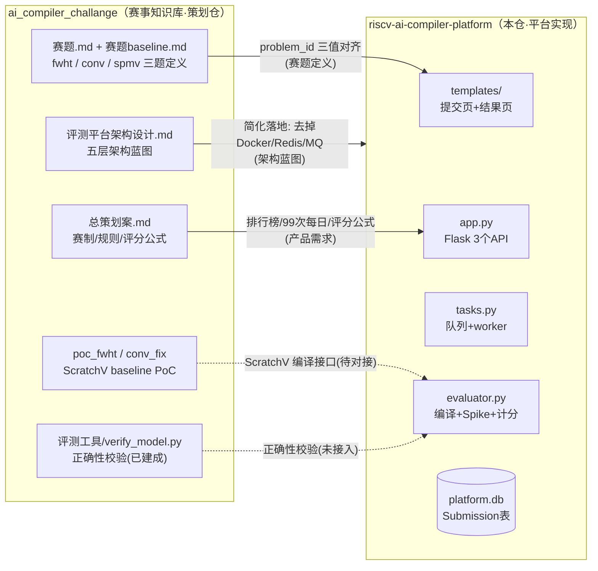
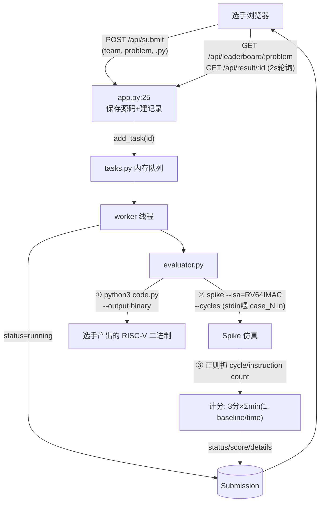

# riscv-ai-compiler-platform

「RISC-V AI 编译器比赛平台」（Flask + SQLite 的轻量 OJ 原型）。

姊妹仓 [`ai_compiler_challange`](../ai_compiler_challange) 是赛事的**策划与赛题仓库**（总策划案、赛题、baseline 验证）；本仓是其中"评测系统"一节的**最小可运行落地**。

## 快速开始

```bash
pip install -r requirements.txt
python app.py        # http://0.0.0.0:5000
```

## 功能

- Web 提交：队伍名 + 赛题（fwht / conv / spmv）+ Python 源码（≤10MB）
- 后台 worker 线程异步评测：跑选手脚本产出 RISC-V 二进制 → Spike 仿真计时 → 按 `baseline/选手` 计分
- 排行榜（按 problem 过滤，取 top 50）+ 结果详情页（2s 轮询）

## 多场竞赛

平台支持**多场竞赛**：赛题 + 提交 + 榜单 + 队伍按场次隔离，用户账号全局。
场次在 `contests.py` 里**用代码注册**，URL 形如 `/c/<slug>/...`（旧 URL 会 302 到默认场次）。
详见 [`docs/10-多场次设计.md`](docs/10-多场次设计.md)。

> **升级到多场次需要迁移数据库**——`db.create_all()` 不会 ALTER 已有表，而本次要改唯一约束，
> SQLite 只能重建表。**首次运行前**先迁移（会自动备份）：
>
> ```bash
> .venv/bin/python tools/migrate_multicontest.py            # 先看计划（dry-run）
> .venv/bin/python tools/migrate_multicontest.py --apply    # 备份并写入
> ```

## 仓库结构

| 文件 | 职责 |
|------|------|
| `app.py` | Flask 入口：`/api/submit`、`/api/result/<id>`、`/api/leaderboard/<problem>` |
| `config.py` | SQLite 路径、上传/测试数据目录、评测超时 120s |
| `contests.py` | **场次注册表**（多场竞赛）：场次定义、赛题挑选与规格覆盖、生命周期 |
| `models.py` | `Submission` 表（contest/team/problem/code_path/status/score/details） |
| `tasks.py` | 内存队列 + 后台 worker 线程 |
| `evaluator.py` | 编译选手代码、Spike 运行、解析 cycles/instructions、计分 |
| `templates/` | 提交页 + 结果轮询页（Bootstrap 5 CDN） |

## 与 ai_compiler_challange 的关系

```
ai_compiler_challange（赛事知识库）          riscv-ai-compiler-platform（本仓）
├─ 总策划案.md  ——赛事规则/赛制──────→  排行榜、提交次数等产品需求来源
├─ 评测平台架构设计.md ——蓝图──────→  本仓是其简化 PoC（无 Docker/Redis/MQ）
├─ 赛题.md ——三道题 fwht/conv/spmv──→  前端下拉框、problem_id 与之一一对应
├─ 评测工具/verify_model.py ——正确性─→  本仓尚未接入正确性校验
└─ ScratchV baseline PoC ─────────→  evaluator.py 需对接的编译接口
```

## 已知问题（现状 vs 规划）

- `app.py:35` 使用 `time.time()` 但**未 import time**，提交接口会直接 500
- `tasks.py:19` 引用未定义的 `app`、未 import `json`，worker 首个任务即崩
- 前端 `/result/<id>` 链接存在，但 `app.py` **没有该路由**，详情页 404
- 正确性校验未接入（策划案一票否决项，`verify_model.py` 未对接）
- 无 Docker 隔离 / 查重 / 提交限频（架构设计文档中的安全项均未落地）
- `evaluator.py` 为占位实现：Spike 路径、baseline 数据、ScratchV 接口均需按 `ai_compiler_challange/评测工具` 的实际口径修正（指南明确禁用 `--estimate`）

## 关系流图

### 两仓关系



### 平台内部评测流水线（实线=已实现，虚线=占位/待修）


